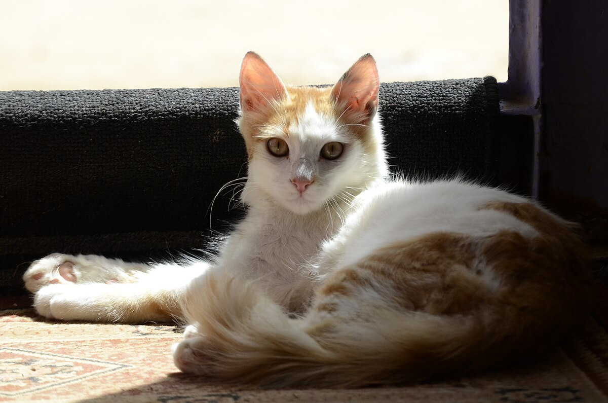

## основы создания ссылок

[текст ссылки](https://ksergey.ru)

## Альтернативный способ указания ссылки 

[текст ссылки][1]

Какой-то текст 

[1]: https://ksergey.ru

## Автоматические ссылки

<https://ksergey.ru>

## Относительные ссылки 

[Списки](06-lists.md)

[КОтейко 1](../The_resting_cat.jpg)

[КОтейко 2](../The_resting_cat.jpg)

[Котейко](The_resting_cat.jpg)  

## Основы выставки изображений 

  

[котик](https://yandex.ru/images/search?img_url=https%3A%2F%2Fupload.wikimedia.org%2Fwikipedia%2Fcommons%2F0%2F03%2FThe_resting_cat.jpg&lr=29393&pos=0&rpt=simage&source=serp&text=%D0%BA%D0%BE%D1%88%D0%BA%D0%B0%20jpg)

## Размеры изображений

